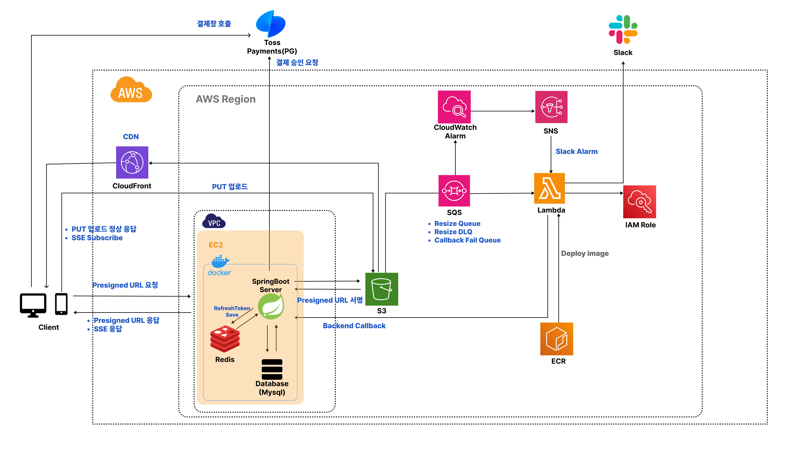
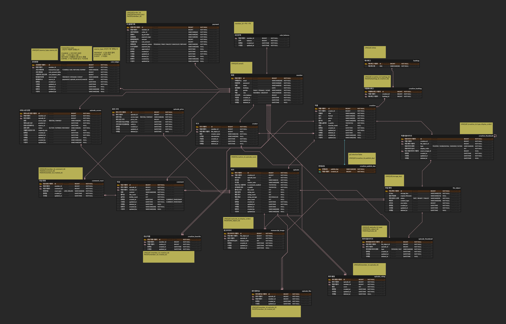

# Creatorhub
웹툰을 창작하는 작가와 작품을 즐겨보는 독자 모두를 위한 **웹툰 플랫폼의 백엔드 서버**로 작품 업로드, 작품 뷰, 결제 시스템 등 핵심 기능을 제공합니다.
<br/>
<br/>

### 시연영상

### 주요기능
#### 👨‍🎨 작가 기능
- 작품 등록(작품 정보, 썸네일 이미지 업로드)
- 회차 등록(회차 정보, 썸네일·원고 이미지 업로드)

#### 📚 독자 기능
- Cursor 방식의 요일별 작품 조회(인기순·조회수·별점순)
- 작품 및 회차 상세 조회
- 관심 작품 등록 / 회차별 평점·좋아요 등록

#### 🖼 작품 썸네일·원고 이미지 처리
- S3 Presigned URL 기반 이미지 업로드
- SQS + Lambda 비동기 이미지 리사이징
- SSE 기반 이미지 처리 완료 알림

#### 💳 결제 시스템
- Toss Payments 결제 연동
- 결제 검증 및 코인 충전

#### 🔐 인증
- JWT 기반 인증
- Redis TTL 기반 Refresh Token 관리

---

## ☁️ 1. 아키텍쳐 다이어그램


---
## 🗄️ 2. ERD
[ERD 상세 보기(클릭)](https://www.erdcloud.com/d/acRK6DAyfKdTHhQCe)


---
## 🛠️ 2. 기술 스택

### Backend
- JDK 21
- Spring Boot 3.5.7
- MySQL 8.0
- Redis 7.2-alpine
- Gradle 8.14.3
- Spring Data JPA(Hibernate)
- Flyway (DB Migration)

### Infra
- AWS S3 (이미지 파일 저장)
- AWS Lambda + SQS (이미지 비동기 처리)
- Docker Compose (로컬/운영 환경 구성)
- Prometheus + Grafana (모니터링)
- k6 (부하 테스트)

---

## 📦 3. 프로젝트 구조

### 1) Application

```
src/
└─ main/
   ├─ java/        # 도메인 중심 패키지 구조
   └─ resources/
   ├─ application.yml # 공통
   ├─ application-local.yml # 개발용
   ├─ application-local-secret.yml # 개발용(비공개, gitignore)
   ├─ application-prod.yml # 배포용
   └─ application-test.yml # 테스트용
```
- 환경별 설정 분리를 통해 개발/테스트/운영 설정 분리


### 2) Infra
```
infra/
└─ lambda-image-resize/ 
   ├─ Dockerfile # 람다 컨테이너 이미지 빌드용(ECR 업로드 대상)
   └─ index.js # 리사이징 lambda함수
```
- 이미지 리사이즈 로직을 애플리케이션과 분리하여 비동기 처리 파이프라인 구성


### 3) Performance & Monitoring
```
k6/   # 부하 테스트 스크립트
```
- k6 기반 시나리오 테스트 및 Prometheus + Grafana 모니터링 구성


### 4) Deployment
```
.env # docker 컨테이너 생성시 사용(비공개, gitignore)
.env.example # .env 샘플
docker-compose.monitoring.yml # 모니터링용
docker-compose.override.yml # 개발용
docker-compose.prod.yml # 배포용
docker-compose.yml # 공통
Dockerfile # 배포용 컨테이너 이미지 빌드용
```
- 개발/운영 환경을 분리한 Docker 컨테이너 기반 배포 구조

---

## ⭐ 4. ISSUE 및 해결방법

### 1. 썸네일·원고 이미지 처리
[💡이미지 처리 문제 해결 과정 상세보기(클릭)](docs/architecture/creation-image-upload-resize.md)

#### - 썸네일·원고 이미지 업로드 처리 / 업로드 후 첫 노출시 지연 최소화
- Issue: 이미지 업로드 및 리사이징을 서버에서 직접 처리할 경우 서버 부하 증가
- Decision: **CloudFront + S3 Presigned URL + SQS + Lambda 기반 비동기 처리 파이프라인 구성**
- Reason: 서버 부하를 줄이고 이미지 리사이징 작업을 비동기로 처리하여 응답 지연 최소화

#### - 이미지 처리 완료 알림
- Issue: 비동기 이미지 처리 완료 여부를 클라이언트가 확인하기 어려움 → Polling과 SSE 중 선택 필요
- Decision: **Lambda → Backend Callback → SSE 알림 구조 적용**
- Reason: 불필요한 트래픽을 줄이고 클라이언트에서 코드 구현을 단순화 하기 위해 SSE 적용

### 2. JWT + Redis 기반 인증
[💡인증시 문제 해결 과정 상세보기(클릭)](docs/architecture/jwt_redis.md)

#### - 인증방식
- Issue: 세션방식과 JWT 방식중 선택 필요
- Decision: **JWT 방식**
- Reason: 차후 서버의 수평 확장시(Scale-out ) 비용·지연·장애 대응 부담이 커져 세션 방식은 채택하지 않음

#### - Refresh Token 저장소
- Issue: Refresh Token 저장소로 RDB 또는 Redis 중 선택 필요
- Decision: **Redis 사용**
- Reason: TTL 기반 자동 만료로 토큰 정리 작업을 최소화하고 인증 요청 성능 확보

### 4. 요일별 웹툰 조회시 대량 데이터 페이징 처리
- Issue: Offset 기반 페이징은 데이터 증가 시 성능 저하 발생
- Decision: **Cursor 기반 페이징** 적용
- Reason: 대량 데이터 조회 시 성능 저하 방지 및 안정적인 페이지 탐색 가능

### 5. 데이터 무결성 처리
- Issue: 관심작품, 좋아요 등 사용자 행동 데이터의 동시 요청 처리 필요
- Decision: **DB Unique 제약조건과 원자적 업데이트 쿼리** 사용
- Reason: 중복 데이터 방지 및 데이터 일관성 유지

### 6. DB 스키마 관리
- Issue: DB 스키마 변경 이력 관리 필요
- Decision: **Flyway 기반 Migration 적용**
- Reason: 버전 기반 스키마 관리 및 환경 간 DB 불일치 방지

---

## ⚙️ 5. 설계 규칙
### 1. DB / Entity 설계 정책
[💡RDB 설계 원칙과 제약조건 상세보기(클릭)](docs/db/schema-policy.md) <br/>
  - 도메인 식별자 및 사용자 액션(좋아요, 관심작품, 평점 등)은 DB `UNIQUE` 제약으로 중복을 차단하여 데이터 무결성과 멱등성 보장
  - Enum 값은 DB에 VARCHAR로 저장하여 코드 Enum 변경이 DB 마이그레이션으로 확장되는 것을 방지
  - 썸네일 및 원고 이미지는 display_order로 관리하여 순서 충돌 및 중복 데이터 방지

[💡Index 정책 상세보기(클릭)](docs/db/index-design.md) <br/>
  - 인덱스는 컬럼이 아닌 실제 조회 패턴(WHERE + ORDER BY)을 기준으로 설계
  - 정렬과 페이징 성능을 위해 복합 인덱스와 UNIQUE 제약을 활용하여 추가 정렬 비용을 최소화

[💡Entity 정책 상세보기(클릭)](docs/db/entity-relationship-policy.md) <br/>
  - JPA 연관관계는 **단방향 우선 전략**을 적용하고, 생명주기 관리가 필요한 경우에만 양방향 + cascade/orphanRemoval 사용

### 2. Spring Security 기반 인증 구조
- JWT 인증 + Role 기반 접근 제어 → API 권한 관리 일관성 확보
### 3. Lambda Callback HMAC 검증
- 이미지 리사이징 완료시 백엔드 콜백 요청에 대해 HMAC 검증 적용 → 외부 요청 위변조 방지

---

## 📊 6. 성능 테스트

---

## 🐳 7. Docker 기반 실행/배포

- MySQL DB, Redis, Spring Boot 앱(creatorhub-server)을 Docker Compose를 통해 실행할 수 있습니다. 
- 모든 민감한 설정 값은 실행 시 환경변수(.env)로 주입합니다.

<br/>

### 🔹 Local Development (개발용 실행)
1. 개발시 mysql, redis 컨테이너만 사용합니다.

```bash
docker compose up -d mysql redis # docker-compose.override.yml 포함
```

- (참고) docker-compose.override.yml은 내 로컬의 특정 포트로 들어온 요청을 컨테이너 안의 포트로 포워딩하기 위해 아래와 같이 구성되어 있습니다.
```
 services:
  mysql:
    ports: ["3306:3306"]
  redis:
    ports: ["6379:6379"]
```

<br/>

2. IAM에서 로컬 개발용 사용자를 생성한 뒤, 로컬에서 AWS 자격증명을 설정합니다.

- 로컬에서 presigned URL 발급 및 ECR push을 위해 사용합니다.(배포는 EC2 IAM Role를 사용)
  - `presigner.presignPutObject(...)` 호출 시, 백엔드가 S3 PutObject 요청에 서명한 presigned URL을 발급합니다.
  - ECR에는 Lambda 컨테이너 이미지(Docker 이미지) 를 push 합니다.
- 설정을 위해 AWS CLI를 설치한 후 aws configure 로 자격증명을 등록합니다.[(AWS CLI 설치: 링크)](https://docs.aws.amazon.com/ko_kr/cli/latest/userguide/getting-started-install.html)

```bash
aws configure
```

```
AWS Access Key ID:     IAM User에서 발급받은 Access Key
AWS Secret Access Key: IAM User에서 발급받은 Secret Key
Default region name:   ap-northeast-2
Default output format: json
```

<br/>

3. 개발 환경에서는 application-local.yml을 사용하므로 환경변수를 local로 지정해 실행합니다.

- gradlew로 실행시 아래와 같이 실행합니다.
```bash
./gradlew bootRun --args="--spring.profiles.active=local" # 리눅스
.\gradlew.bat bootRun --args="--spring.profiles.active=local" # 윈도우
```

- IDE로 실행시 환경변수에 아래 값을 지정한 후 실행합니다.
```
SPRING_PROFILES_ACTIVE=local
```

<br/>

### 🔹 Production Deployment (배포/운영 실행)
&emsp;&emsp; [배포 가이드 보기(클릭)](deployment-guide.md)

<br/>
