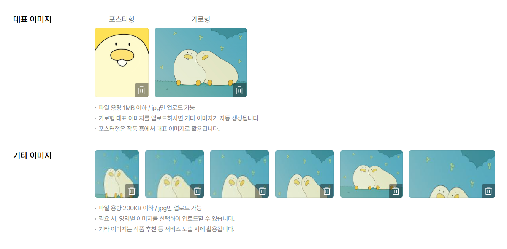
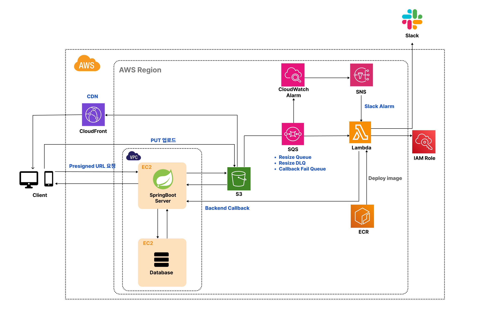

# 작품 이미지 업로드 & 리사이징 처리 

## ✅ 요구사항

### 작품등록시 썸네일 이미지 업로드

- 업도드 할 작품 썸네일 이미지는 대표 이미지(포스터형, 가로형)와 기타이미지 6장으로 나눠짐
- 대표 이미지인 포스터형과 가로형은 각각 별도의 이미지 업로드 가능
- 기타이미지 6장은 가로형 이미지 등록시 자동 리사이징
- 이미지 업로드 완료시 사용자에게 미리보기로 보여줌
- 이미지 업로드/리사이징 실패시 재처리 가능해야 하며 운영자가 원인을 추적할 수 있어야 함

 

## 🛠️ ISSUE & 해결방법

### **1. 첫번째 ISSUE: 이미지 업로드를 어떻게 처리할 것인가?**
- **해결방법**: **AWS S3 Presigned URL 사용, S3 bucket**에 이미지 업로드
- **이유**: 프론트엔드에서 업로드 처리시 백엔드에서의 업로드 보다 Scale/비용면에서 효율적

### **2. 두번째 ISSUE: 리사이징은 어떻게 처리할 것인가?**
- **해결방법**: 
  - 포스터형과 가로형: **프론트엔드에서 리사이징**처리
  - 기타이미지: 가로형 이미지 등록시 **AWS Lambda**처리를 통해 6장 자동 리사이징

- **이유:** 포스터형/가로형 이미지는 사용자 미리보기 UX가 중요하여 프론트엔드에서 즉시 리사이징한다.
    다만 최종 업로드 결과물의 규격(용량/MIME)은 서버에서 검증하여 일관성을 유지한다.
    반면 '기타 이미지 6장'은 플랫폼이 규칙 기반으로 생성하는 파생 리소스이므로, 결과 품질과 규격을 서버 측에서 강제하기 위해 AWS Lambda로 비동기 생성한다.

### **3. 세번째 ISSUE: 이미지 업로드/리사이징 실패시 재처리**
- **해결방법:** SQS 사용을 통해 **Resize Queue(리사이즈 처리 큐)와 Resize DLQ(리사이즈 실패 처리 큐)** 를 지정 
    → 리사이징 실패시 3번 시도 후 안되면 Resize DLQ에 적재 
    → 이후 CloudWatch → SNS → Slack으로 실패 메세지 전송(Lambda)
- **이유:** 리사이징은 비동기 처리 특성상 일시적 장애가 빈번할 수 있어 SQS 재시도로 자동 복구율을 높였다. 반복 실패 메시지는 DLQ로 격리해 무한 재시도와 큐 적체를 방지하고, CloudWatch→SNS→Slack 알림으로 운영자가 즉시 대응할 수 있도록 함.

### **4. 네번째 ISSUE: Lambda의 비동기 동작 완료 후 프론트엔드에 결과 통보 방식**
- **고민:** 폴링(Polling) vs SSE(Server-Sent Events)
- **해결방법: SSE 이용**
- **이유:** 폴링은 요청이 반복되어 서버/DB 부하가 누적되지만 SSE는 업로드 직후 짧은 시간 동안만 연결을 유지하면서 완료 이벤트를 서버가 즉시 push할 수 있어, 불필요한 트래픽을 줄인다. 또한 폴링의 interval/재시도/타임아웃 관리 로직을 제거해 클라이언트 구현을 단순화.

### **5. 다섯번째 ISSUE: 업로드 후 이미지 첫 노출 레이턴시(Latency) 최적화**
   - **해결방법:** CDN 캐시(CloudFront)를 이용
   - **이유:** S3 직접 접근 대신 CDN 캐시(CloudFront)를 통해 첫 로딩과 이후 재방문 속도 개선

 

## ☁️ 최종 Architecture & Flow

### 포스터형 or 가로형 썸네일 이미지 등록 과정
1. **Client → SpringBoot:** presigned URL 발급 요청
2. **SpringBoot → S3:** presigned URL 생성(서명)
3. **SpringBoot → Client → S3:** presigned URL로 원본 이미지 PUT 업로드
4. **Client → SpringBoot:** S3에서 업로드 완료 응답시 file_object 테이블의 이미지 메타 정보 중 status를 READY로 변경

### 가로형 썸네일 이미지 등록시 6개 이미지 리사이징 과정(이전 과정까지는 동일)
5. **Client → SpringBoot:** S3에서 업로드 완료 응답시 SSE Subscribe
5. **(Trigger) S3 이벤트 → SQS 적재(Resize Queue)**
   - 리사이징 실패시 3번 시도 후 **안되면** Resize DLQ에 적재
   - 이후 CloudWatch → SNS → Slack으로 실패 메세지 전송(Lambda)
6. **SQS → Lambda:** 리사이징 작업 실행(6개의 파생 이미지 생성)
7. **Lambda → S3:** 파생 이미지 저장
8. **Lambda → SpringBoot:** 처리 완료 후 백엔드로 콜백(HMAC 인증) → SSE로 완료 알림
    - 백엔드 콜백 실패시 Callback Fail Queue에 적재
9. **Client → CloudFront → S3:** CDN 캐시 기반 이미지 제공

 

## 🔧 개선점
1. 이미지 등록 취소시 S3에 이미 업로드 된 사용하지 않는 이미지 제거
2. 백엔드 콜백 실패시 Callback Fail Queue에 적재된 작업 재시도 처리
3. Lambda Cold Start 처리
