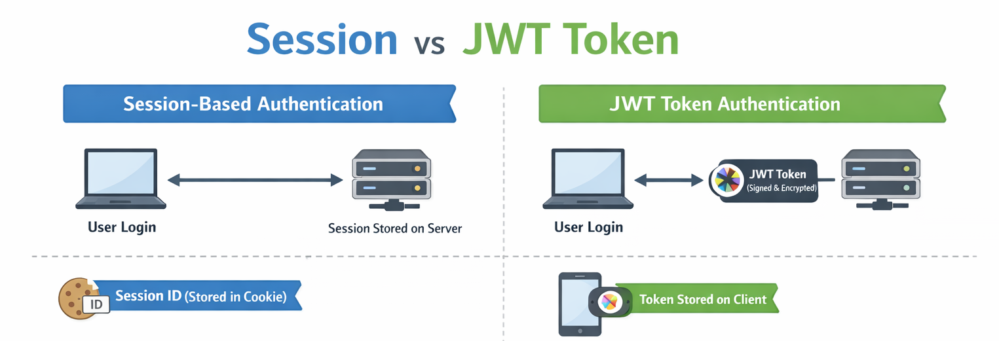

# 로그인시 JWT 토큰 / Redis 도입과정

## ✅ ISSUE: 로그인을 어떻게 처리 할 것인가?

### '세션(Session) 방식'  vs 'JWT 토큰 방식'

 

## ⚠️ 세션(Session) 방식 로그인의 한계

웹툰은 콘텐츠 소비이므로 사용자가 많고 모바일, PC, 앱 등 다양한 환경에서 접속.
인증 방식은 아래 요구사항을 만족하도록 고려.

#### - 요구사항: Scale-out 환경에서 로그인 상태가 안정적으로 유지되어야 함
트래픽이 커지면서 서버의 수평 확장(Scale-out)을 생각하게 되었지만 세션 방식을 사용시 아래와 같은 문제 발생 가능성 있음 
- 예) 세션을 서버 메모리에 저장하면, 사용자가 '서버1'에서 로그인한 뒤 로드밸런싱으로 '서버2'로 라우팅될 경우 세션을 찾지 못해 로그인이 풀릴 수 있음. 
#### - 해결방법: Redis와 같은 중앙 세션 저장소 사용
#### - But,  세션 기반 인증은 요청마다 세션 조회가 발생하므로 트래픽이 커질수록 Redis 조회 QPS가 증가.
#### - 결론: 운영 관점에서는 비용, 지연, 장애 대응 부담이 커져 세션 방식은 채택하지 않음

서비스는 트래픽 증가에 따라 수평 확장(Scale-out) 이 필요했고, 서버가 인증 상태(세션)를 들고 있으면 확장 시 구조가 복잡해진다.
따라서 인증은 서버 상태에 의존하지 않는 Stateless 방식이 적합하다고 판단했고, 최종적으로 JWT 기반 토큰 인증(Access/Refresh) 을 채택.

 

## 📌 또다른 ISSUE: Refresh Token의 저장 방식

Access Token 만료시 토큰을 갱신할 방법으로 Refresh Token을 사용해야 했고, 
Refresh Token을 어디에 저장 해야하는지에 대한 이슈가 발생. 또한 보안상 아래 요구사항을 만족시키는 것을 고려. 

#### - 요구사항: '강제 로그아웃' 기능 적용 및 토큰 탈취 확률 줄이기
#### - 해결방법: 저장소에 토큰을 저장
#### - 고민: 그렇다면 저장소는 RDB vs Redis 중 어떤것을 사용할 것인가?
#### - 결론: 만료된 Refresh Token의 제거를 위해 TTL이 가능한 Redis를 사용

비용과 운영을 고려한다면 RDB 였지만 사용하지 않게된 Refresh Token을 Refresh Token의 유효기간에 맞춰 제거하는 것이 중요하다고 생각.
RDB 사용시 배치 등으로 만료된 토큰의 제거는 가능하지만, Refresh Token은 유효기간 이후 의미가 없는 임시 데이터이므로
TTL로 자동 만료되는 Redis가 데이터 성격과 운영 단순성 측면에서 더 적합하다고 판단함.

 

## 🔥 최종 결론 및 요약
서버의 수평적 확장을 고려해 Serverless 방식인 JWT 토큰을 적용했으며,
Refresh Token의 저장 방식 문제는 토큰 탈취 확률과 강제 로그아웃 가능 등 보안상 문제를 줄이기 위해
Redis를 저장소 선택(Redis는 TTL 서비스를 위해 선정)

