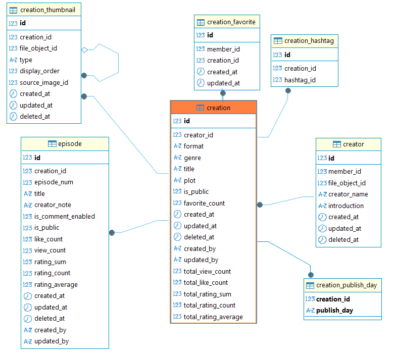
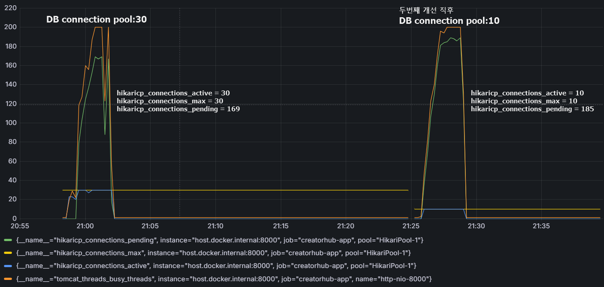
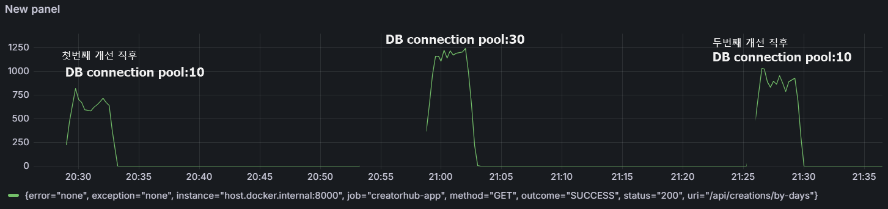

## 요일별 웹툰 읽기 

### 요약
대용량 데이터(작품 7,000 / 에피소드 518k) 환경에서
요일별 웹툰 조회 API 성능 개선을 진행하여
- Throughput: 93 req/s → 935 req/s (10배 증가)
- P95 Latency: 3.13s → 400ms (87% 감소)

---

### Load Test Environment
- Tool: k6
- Scenario: ramping-vus
- Duration: 약 4분
- Server: Spring Boot (Docker)
- Database: MySQL 8
- Dataset
    - Creation: 7,000
    - Episode: 518,146

### 부하 테스트 Scenario 상세
| Stage | Duration | VUs | Description |
|---|---|---|---|
| Warm-up | 30s | 0 → 50 | 서버 워밍업 |
| Ramp-up | 1m | 50 → 200 | 부하 증가 |
| Peak Load | 2m | 200 → 300 | 최대 부하 유지 |
| Ramp-down | 30s | 300 → 0 | 부하 감소 |

### 작품(creation) 데이터
- 총 작품 row: **총 7,000건**
- 연재 중인 row: **총 1,000건**(연재 작품은 is_public값이 true)
- 공개 작품 1,000개에 연재요일 배정 → 요일당 약 142~143개 (1000 / 7)
- is_public(연재 작품)은 creation(작품) 테이블 내에 아래와 같이 분포(최신 등록된 작품일수록 공개)
  - 진행 25%: 공개 확률 6.25%
  - 진행 50%: 공개 확률 25%
  - 진행 75%: 공개 확률 56%
  - 진행 90%: 공개 확률 81%

### 회차(episode) 데이터
-  회차 row: **총 518,146건**(에피소드는 한작품당 1~300화 까지 랜덤하게 등록)

   | 범위 | 확률 | 설명 |
      |-----|-----|-----|
   | 1 ~ 19화 | 15% | 연재 초기 작품 |
   | 20 ~ 100화 | 70% | 가장 많은 비중 |
   | 101 ~ 300화 | 15% | 장기 연재 작품 |

- 각 작품의 모든 회차의 인기순, 조회수, 별점순 sort를 해야 하므로 episode(회차) 테이블 내 1회차당 컬럼에 아래와 같이 랜덤한 수치를 줌
  - like_count(좋아요수-인기순): 0 ~ 5,000
  - view_count(조회수): 100 ~ 1,000,000
  - rating_count(별점수): 0 ~ 7,000
  - rating_sum / rating_average: 계산이 맞는 값


- 참고 ERD



```sql
select count(*) from creation; -- 작품수 7,000건
select count(*) from creation_thumbnail; -- 작품 썸네일 수 7,000건
select count(*) from creation_publish_day; -- 작품 연재요일 7,000건
select count(*) from episode; -- 에피소드 수 518,146건(에피소드는 한작품당 1~300화 까지 랜덤하게 등록)
```

---

### 초기 성능 테스트 결과(Before Optimization)

| Metric | Result |
|---|---|
| Total Requests | 22,614 |
| Throughput | 93 req/s |
| Error Rate | 0% |
| Avg Response Time | 1.91s |
| P90 Response Time | 2.96s |
| P95 Response Time | 3.13s |
| P99 Response Time | 3.35s |
| Max Response Time | 5.35s |

```
    error_rate
    ✓ 'rate<0.01' rate=0.00%

    http_req_duration
    ✗ 'p(95)<500' p(95)=3.13s
    ✗ 'p(99)<1000' p(99)=3.35s

    ...

    HTTP
    http_req_duration..............: avg=1.91s min=41.06ms med=2.16s max=5.35s p(90)=2.96s p(95)=3.13s
      { expected_response:true }...: avg=1.91s min=41.06ms med=2.16s max=5.35s p(90)=2.96s p(95)=3.13s
    http_req_failed................: 0.00%  0 out of 22614
    http_reqs......................: 22614  93.860007/s
    
    ....
```
----

### 첫번째 개선
- Before: 하나의 Creation(작품)당 모든 Episode 테이블을 JOIN → GROUP BY → SUM() 집계(Episode 518k rows scan이 발생하므호 GROUP BY 비용 증가)
- After: Creation에 사전 계산된 집계 컬럼(totalViewCount, totalLikeCount, totalRatingAverage, totalRatingCount)을 추가해 직접 사용
 
 | 쿼리 | 변경 전 | 변경 후 |
  |---|---|---|
  | findByDayOrderByViewsSeek | JOIN Episode + `SUM(e.viewCount)` | `c.totalViewCount` |
  | findByDayOrderByLikesSeek | JOIN Episode + `SUM(e.likeCount)` | `c.totalLikeCount` |
  | findByDayOrderByRatingSeek | JOIN Episode + `SUM/CASE` 계산 | `c.totalRatingAverage`, `c.totalRatingCount` |

### 첫번째 개선 후(1st Optimization)
- 수치가 다소 좋아졌으나 여전히 P95 Response Time가 500ms이 넘어감
- **P95 Response Time을 500ms 이하로 목표**

| Metric | Result |
|---|---|
| Total Requests | 114,460 |
| Throughput | 474 req/s |
| Error Rate | 0% |
| Avg Response Time | 374.83 ms |
| P90 Response Time | 587.45 ms |
| P95 Response Time | 626.42 ms |
| P99 Response Time | 906.53 ms |
| Max Response Time | 1.6 s |
```
    error_rate
    ✓ 'rate<0.01' rate=0.00%

    http_req_duration
    ✗ 'p(95)<500' p(95)=626.42ms
    ✓ 'p(99)<1000' p(99)=906.53ms
    
    ...

    HTTP
    http_req_duration..............: avg=374.83ms min=9.32ms  med=427.48ms max=1.6s  p(90)=587.45ms p(95)=626.42ms
      { expected_response:true }...: avg=374.83ms min=9.32ms  med=427.48ms max=1.6s  p(90)=587.45ms p(95)=626.42ms
    http_req_failed................: 0.00%  0 out of 114460
    http_reqs......................: 114460 474.766733/s
    
    ...
```

---

### 두번째 개선

#### [connection pool 증가 후 확인]

- 결론: connection pool을 30까지 증가시켰지만 pending 수치가 169라는 병목이 크기 때문에 쿼리문을 튜닝하기로 결정

#### [쿼리문 튜닝]
- 쿼리 3번 → 1번: 기존에 creation테이블 1회, creation테이블 1회, creation_thumbnail 테이블 1회 조회를 JOIN으로 한번에 조회
  - CreationService: findByIdIn, findPostersByCreationIds 호출 제거
- JPQL → 네이티브로 변경: MEMBER OF 제거, COALESCE 제거, LIMIT: size 직접 사용

### 두번째 개선 후(Final Optimization)
| Metric | Result |
|---|---|
| Total Requests | 204,197 |
| Throughput | 935 req/s |
| Error Rate | 0.02% |
| Avg Response Time | 204.67 ms |
| P90 Response Time | 353.79 ms |
| P95 Response Time | 400.65 ms |
| P99 Response Time | 646.02 ms |
| Max Response Time | 1.69 s |
```
    error_rate
    ✓ 'rate<0.01' rate=0.02%

    http_req_duration
    ✓ 'p(95)<500' p(95)=400.65ms
    ✓ 'p(99)<1000' p(99)=646.02ms

    ...

    HTTP
    http_req_duration..............: avg=204.67ms min=-3425871007ns med=219.65ms max=1.69s  p(90)=353.79ms p(95)=400.65ms
      { expected_response:true }...: avg=204.72ms min=-3425871007ns med=219.69ms max=1.69s  p(90)=353.8ms  p(95)=400.67ms
    http_req_failed................: 0.02%  45 out of 204197
    http_reqs......................: 204197 935.941841/s
    
    ...
```

---

### 그 밖에 INDEX 적용 시도

아래 조회 쿼리에 대해 `(publish_day, creation_id)` 인덱스를 적용했으나 오히려 성능이 저하되는 현상이 발생

원인 분석:

- `creation.is_public = true` 조건에 해당하는 데이터는 약 **1,000건**
- 전체 creation 데이터(7,000건) 대비 **선택도가 낮은 조건**

이 경우 MySQL Optimizer는 인덱스 탐색보다 **Full Table Scan + Filter 방식이 더 효율적**이라고 판단
따라서 해당 인덱스는 실제 성능 개선에 기여하지 못해 제거

```sql
SELECT
  ...
FROM creation c
JOIN creation_publish_day cpd
  ON cpd.creation_id = c.id
 AND cpd.publish_day = :day
  ...
WHERE c.is_public = true
```

---

### 최종 TPS 변화


### 부하 테스트 수치 변화

| Metric | Before | 1st Optimization | Final Optimization |
|---|---|---|---|
| Total Requests | 22,614 | 114,460 | 204,197 |
| Throughput | 93 req/s | 474 req/s | 935 req/s |
| Error Rate | 0% | 0% | 0.02% |
| Avg Response Time | 1.91 s | 374.83 ms | 204.67 ms |
| P90 Response Time | 2.96 s | 587.45 ms | 353.79 ms |
| P95 Response Time | 3.13 s | 626.42 ms | 400.65 ms |
| P99 Response Time | 3.35 s | 906.53 ms | 646.02 ms |
| Max Response Time | 5.35 s | 1.6 s | 1.69 s |