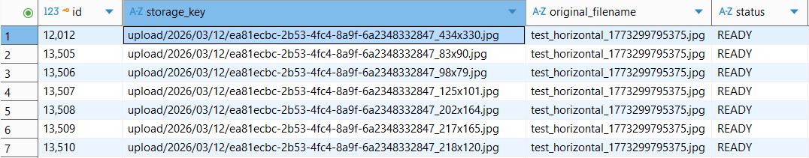

## 작품 등록하기

### Load Test Environment
- Tool: k6
- Scenario: ramping-vus
- Duration: 약 4분
- Server: Spring Boot (Docker)
- Database: MySQL 8

### 부하 테스트 Scenario 상세
| Stage | Duration | VUs | Description |
|---|---|---|---|
| Warm-up | 30s | 0 → 5 | 서버 워밍업 |
| Ramp-up | 1m | 5 → 20 | 부하 증가 |
| Peak Load | 2m | 20 → 30 | 최대 부하 유지 |
| Ramp-down | 30s | 30 → 0 | 부하 감소 |

작품 등록 플로우에 대해 로그인, Presigned URL 발급, S3 업로드, 썸네일 READY 처리, SSE 기반 리사이징 완료 수신, 최종 작품 등록까지 포함한 E2E 부하 테스트를 수행했다.
테스트 결과 작품 등록 API 자체는 p95 61ms로 매우 빠르게 동작했으며, 전체 플로우 p95는 8.5초였다. 전체 지연의 대부분은 비동기 이미지 리사이징 완료를 기다리는 SSE 구간에서 발생했으며, 동기 API 구간은 전반적으로 안정적이었다.
또한 전체 에러율은 0.02% 수준으로 낮게 유지되어, 이미지 처리 파이프라인을 포함한 등록 흐름이 부하 상황에서도 안정적으로 동작함을 확인했다.

```
 █ THRESHOLDS 

    creation_create_duration
    ✓ 'p(95)<3000' p(95)=61.44ms
    ✓ 'p(99)<5000' p(99)=97.86ms

    error_rate
    ✓ 'rate<0.05' rate=0.02%

    s3_upload_duration
    ✓ 'p(95)<5000' p(95)=73.17ms

    total_flow_duration
    ✓ 'p(95)<60000' p(95)=8.5s


  █ TOTAL RESULTS 

    checks_total.......: 12761  52.689635/s
    checks_succeeded...: 99.96% 12757 out of 12761
    checks_failed......: 0.03%  4 out of 12761

    ✓ [login] status 200
    ✓ [login] accessToken 존재
    ✓ [presigned:POSTER] status 200
    ✓ [presigned:POSTER] uploadUrl 존재
    ✓ [presigned:POSTER] fileObjectId 존재
    ✓ [s3 upload] status 200
    ✓ [ready:POSTER] status 200
    ✓ [presigned:HORIZONTAL] status 200
    ✓ [presigned:HORIZONTAL] uploadUrl 존재
    ✓ [presigned:HORIZONTAL] fileObjectId 존재
    ✓ [sse] status 200
    ✗ [create] status 200
      ↳  99% — ✓ 975 / ✗ 2
    ✗ [create] creationId 존재
      ↳  99% — ✓ 975 / ✗ 2

    CUSTOM
    creation_create_duration.......: avg=45.3ms   min=17.83ms med=41.56ms max=797.27ms p(90)=56.07ms p(95)=61.44ms
    error_rate.....................: 0.02%  2 out of 7846
    login_duration.................: avg=83.78ms  min=74.39ms med=81.61ms max=114.18ms p(90)=90.87ms p(95)=94.79ms
    mark_ready_duration............: avg=42.68ms  min=23.8ms  med=38.83ms max=410.88ms p(90)=57.16ms p(95)=66.92ms
    presigned_duration.............: avg=17.79ms  min=10.68ms med=15.31ms max=690.95ms p(90)=21.94ms p(95)=25.43ms
    resize_timeout_count...........: 2      0.008258/s
    s3_upload_duration.............: avg=44.06ms  min=27.3ms  med=38.78ms max=155.54ms p(90)=63.13ms p(95)=73.17ms
    sse_event......................: 1952   8.059726/s
    sse_poll_duration..............: avg=4.11s    min=1.88s   med=3.38s   max=30.05s   p(90)=6.89s   p(95)=8.27s  
    total_flow_duration............: avg=4.32s    min=2.12s   med=3.66s   max=20.45s   p(90)=7.1s    p(95)=8.5s   

    HTTP
    http_req_duration..............: avg=543.35ms min=10.68ms med=37.65ms max=30s      p(90)=2.42s   p(95)=3.88s  
      { expected_response:true }...: avg=36.55ms  min=10.68ms med=36.06ms max=797.27ms p(90)=55.48ms p(95)=65.75ms
    http_req_failed................: 0.02%  2 out of 6869
    http_reqs......................: 7846   32.395805/s

    EXECUTION
    iteration_duration.............: avg=4.36s    min=2.12s   med=3.66s   max=30.31s   p(90)=7.13s   p(95)=8.55s  
    iterations.....................: 977    4.033992/s
    vus............................: 2      min=0         max=30
    vus_max........................: 30     min=30        max=30

    NETWORK
    data_received..................: 6.9 MB 29 kB/s
    data_sent......................: 25 MB  103 kB/s
```

REPORT RequestId: 74e3df7e-a98c-5b32-be75-bd54b9c29a28 Duration: 8826.79 ms Billed Duration: 8827 ms Memory Size: 128 MB Max Memory Used: 127 MB


Lambda Memory Size: 512 MB로 증가시킴


```
  █ THRESHOLDS 

    creation_create_duration
    ✓ 'p(95)<3000' p(95)=66.93ms
    ✗ 'p(99)<5000' p(99)=6.44s

    error_rate
    ✓ 'rate<0.05' rate=0.27%

    s3_upload_duration
    ✓ 'p(95)<5000' p(95)=76.67ms

    total_flow_duration
    ✓ 'p(95)<60000' p(95)=8s


  █ TOTAL RESULTS 

    checks_total.......: 22043  99.02457/s
    checks_succeeded...: 99.66% 21969 out of 22043
    checks_failed......: 0.33%  74 out of 22043

    ✓ [login] status 200
    ✓ [login] accessToken 존재
    ✓ [presigned:POSTER] status 200
    ✓ [presigned:POSTER] uploadUrl 존재
    ✓ [presigned:POSTER] fileObjectId 존재
    ✓ [s3 upload] status 200
    ✓ [ready:POSTER] status 200
    ✓ [presigned:HORIZONTAL] status 200
    ✓ [presigned:HORIZONTAL] uploadUrl 존재
    ✓ [presigned:HORIZONTAL] fileObjectId 존재
    ✓ [sse] status 200
    ✗ [create] status 200
      ↳  97% — ✓ 1654 / ✗ 37
    ✗ [create] creationId 존재
      ↳  97% — ✓ 1654 / ✗ 37

    CUSTOM
    creation_create_duration.......: avg=170.55ms min=112.92µs      med=46.04ms max=6.86s  p(90)=58.29ms  p(95)=66.93ms 
    error_rate.....................: 0.27% 37 out of 13558
    login_duration.................: avg=311.03ms min=81.69ms       med=87.69ms max=6.74s  p(90)=102.33ms p(95)=107.21ms
    mark_ready_duration............: avg=108.32ms min=55.28µs       med=37.63ms max=6.83s  p(90)=58.39ms  p(95)=72.2ms  
    presigned_duration.............: avg=56.69ms  min=199.58µs      med=16.95ms max=6.82s  p(90)=23.98ms  p(95)=28.14ms 
    resize_timeout_count...........: 37    0.166216/s
    s3_upload_duration.............: avg=103.82ms min=95.38µs       med=42.95ms max=6.81s  p(90)=66.12ms  p(95)=76.67ms 
    sse_event......................: 3345  15.026865/s
    sse_poll_duration..............: avg=1.87s    min=-5832000000ns med=1.48s   max=27.5s  p(90)=2.22s    p(95)=7.95s   
    total_flow_duration............: avg=1.76s    min=-5549000000ns med=1.75s   max=9.36s  p(90)=2.38s    p(95)=8s      

    HTTP
    http_req_duration..............: avg=370.87ms min=55.28µs       med=40.12ms max=30s    p(90)=1.47s    p(95)=1.72s   
      { expected_response:true }...: avg=101.97ms min=55.28µs       med=38.26ms max=6.86s  p(90)=57.07ms  p(95)=69.45ms 
    http_req_failed................: 0.31% 37 out of 11867
    http_reqs......................: 13558 60.907096/s

    EXECUTION
    iteration_duration.............: avg=2.52s    min=1.1s          med=1.89s   max=30.85s p(90)=2.4s     p(95)=2.64s   
    iterations.....................: 1691  7.596541/s
    vus............................: 1     min=0           max=30
    vus_max........................: 30    min=30          max=30

    NETWORK
    data_received..................: 11 MB 47 kB/s
    data_sent......................: 43 MB 192 kB/s
```

```
time="2026-03-12T07:17:02Z" level=warning msg="[sse] RESIZE_COMPLETE 미수신 baseKey=upload/2026/03/12/ea81ecbc-2b53-4fc4-8a9f-6a2348332847" source=console
time="2026-03-12T07:17:03Z" level=error msg="GoError: 작품 등록 실패: status=404 body={\"code\":\"F001\",\"message\":\"존재하지 않는 파일입니다.\",\"timestamp\":\"2026-03-12T16:17:09.4902195\",\"path\":\"/api/creations/create\"}\n\tat go.k6.io/k6/internal/js/modules/k6.(*K6).Fail-fm (native)\n\tat createCreation (file:///home/k6/creation-write-load.js:270:18(97))\n\tat file:///home/k6/creation-write-load.js:334:58(8)\n\tat withAuth (file:///home/k6/creation-write-load.js:295:17(8))\n\tat default (file:///home/k6/creation-write-load.js:334:32(67))\n" executor=ramping-vus scenario=ramp_up source=stacktrace
```

```sql
select * from file_object 
where storage_key 
like '%ea81ecbc-2b53-4fc4-8a9f-6a2348332847%'; 
```


그래서 RESIZE_TIMEOUT =120s로 증가하고 
진짜 느린 구간이 어디인지를 측정
아래 측정 결과 람다 처리 부분으로 추청됨

```
  █ THRESHOLDS 

    creation_create_duration
    ✓ 'p(95)<3000' p(95)=90.17ms
    ✓ 'p(99)<5000' p(99)=188.6ms

    error_rate
    ✓ 'rate<0.05' rate=0.05%

    s3_upload_duration
    ✓ 'p(95)<5000' p(95)=83.69ms

    total_flow_duration
    ✓ 'p(95)<60000' p(95)=8.07s


  █ TOTAL RESULTS 

    checks_total.......: 22789  99.538787/s
    checks_succeeded...: 99.94% 22777 out of 22789
    checks_failed......: 0.05%  12 out of 22789

    ✓ [login] status 200
    ✓ [login] accessToken 존재
    ✓ [presigned:POSTER] status 200
    ✓ [presigned:POSTER] uploadUrl 존재
    ✓ [presigned:POSTER] fileObjectId 존재
    ✓ [s3 upload] status 200
    ✓ [ready:POSTER] status 200
    ✓ [presigned:HORIZONTAL] status 200
    ✓ [presigned:HORIZONTAL] uploadUrl 존재
    ✓ [presigned:HORIZONTAL] fileObjectId 존재
    ✗ [sse] status 200
      ↳  99% — ✓ 1745 / ✗ 4
    ✗ [create] status 200
      ↳  99% — ✓ 1745 / ✗ 4
    ✗ [create] creationId 존재
      ↳  99% — ✓ 1745 / ✗ 4

    CUSTOM
    creation_create_duration.......: avg=100.05ms min=110.4µs       med=52.6ms   max=6.61s p(90)=74.47ms  p(95)=90.17ms 
    error_rate.....................: 0.05% 8 out of 14014
    lambda_callback_duration.......: avg=1.96s    min=-5218000000ns med=1.42s    max=1m1s  p(90)=1.92s    p(95)=2.38s   
    login_duration.................: avg=341.74ms min=195.14µs      med=129.76ms max=6.43s p(90)=201.05ms p(95)=285.12ms
    mark_ready_duration............: avg=82.38ms  min=-6723978485ns med=40.39ms  max=6.48s p(90)=68.94ms  p(95)=89.88ms 
    presigned_duration.............: avg=43.3ms   min=-6728432857ns med=20.63ms  max=6.77s p(90)=32.38ms  p(95)=39.68ms 
    resize_timeout_count...........: 4     0.017471/s
    s3_upload_duration.............: avg=123.28ms min=117.18µs      med=44.02ms  max=6.72s p(90)=69.17ms  p(95)=83.69ms 
    sse_connect_duration...........: avg=17.28ms  min=-6763000000ns med=6ms      max=6.31s p(90)=9ms      p(95)=14ms    
    sse_event......................: 3490  15.243774/s
    sse_publish_duration...........: avg=61.85ms  min=-6689000000ns med=139ms    max=6.74s p(90)=197.6ms  p(95)=6.39s   
    total_flow_duration............: avg=2.2s     min=-5454000000ns med=1.75s    max=1m1s  p(90)=2.49s    p(95)=8.07s   
    upload_ready_duration..........: avg=49.23ms  min=-6711000000ns med=88ms     max=6.69s p(90)=128ms    p(95)=147ms   

    HTTP
    http_req_duration..............: avg=360.99ms min=-6728432857ns med=42.51ms  max=1m7s  p(90)=1.53s    p(95)=1.77s   
      { expected_response:true }...: avg=86.06ms  min=-6728432857ns med=40.5ms   max=6.77s p(90)=65.5ms   p(95)=82.18ms 
    http_req_failed................: 0.03% 4 out of 12265
    http_reqs......................: 14014 61.21096/s

    EXECUTION
    iteration_duration.............: avg=2.49s    min=1.1s          med=1.88s    max=1m7s  p(90)=2.36s    p(95)=2.56s   
    iterations.....................: 1749  7.639358/s
    vus............................: 1     min=0          max=30
    vus_max........................: 30    min=30         max=30

    NETWORK
    data_received..................: 11 MB 48 kB/s
    data_sent......................: 44 MB 193 kB/s


```