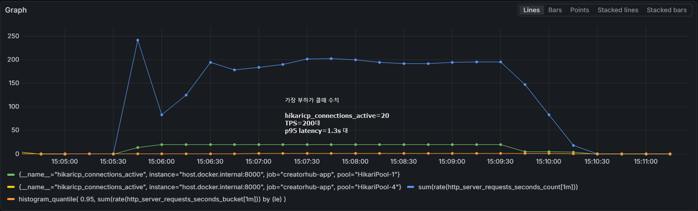
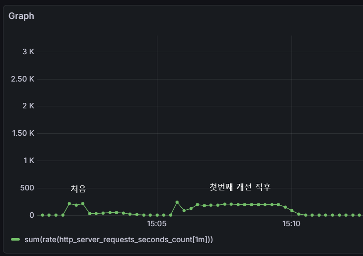
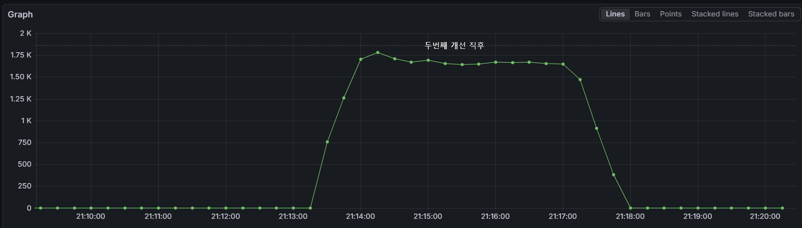

## 특정 회차 웹툰 읽기
#### **웹툰은 회차 보기가 가장 중요하므로 P95 Response Time을 300ms 이하로 목표**

### 요약
대용량 데이터(작품 7,000 / 에피소드 518k) 환경에서 웹툰 회차 조회 API 성능 개선을 진행하여
- Throughput: 151 req/s → 1,679 req/s (11배 증가)
- P95 Latency: 1.97s → 268.45ms (86% 감소)
- 주요 개선: 조회수 UPDATE 비동기 처리 + Caffeine 캐시 적용

---

### Load Test Environment
- Tool: k6
- Scenario: ramping-vus
- Duration: 약 4분
- Server: Spring Boot (Docker)
- Database: MySQL 8
- Dataset
    - Creation: 7,000
    - Episode: 518,146

### 부하 테스트 Scenario 상세
| Stage | Duration | VUs | Description |
|---|---|---|---|
| Warm-up | 30s | 0 → 50 | 서버 워밍업 |
| Ramp-up | 1m | 50 → 200 | 부하 증가 |
| Peak Load | 2m | 200 → 300 | 최대 부하 유지 |
| Ramp-down | 30s | 300 → 0 | 부하 감소 |

---

### 초기 성능 테스트 결과(Before Optimization)

| Metric | Result           |
|---|------------------|
| Total Requests | 36,498           |
| Throughput | **151.98 req/s** |
| Error Rate | **0.00%**        |
| Avg Response Time | 1.17 s           |
| P90 Response Time | 1.88 s           |
| P95 Response Time | 1.97 s           |
| P99 Response Time | 2.08 s           |
| Max Response Time | 3.35 s           |

```
    error_rate
    ✓ 'rate<0.01' rate=0.00%

    http_req_duration
    ✗ 'p(95)<500' p(95)=1.97s
    ✗ 'p(99)<1000' p(99)=2.08s
    
    ... 
    
    HTTP
    http_req_duration..............: avg=1.17s min=13.35ms med=1.26s max=3.35s p(90)=1.88s p(95)=1.97s
      { expected_response:true }...: avg=1.17s min=13.35ms med=1.26s max=3.35s p(90)=1.88s p(95)=1.97s
    http_req_failed................: 0.00%  0 out of 36498
    http_reqs......................: 36498  151.980571/s
    
    ...
```


----

### 첫번째 개선

####  1. 비동기 처리
- **Before:** incrementViewCount + updateTotalViewCount 2개의 UPDATE가 응답 경로에 동기 실행 → 300VU가 같은 행에 UPDATE 락 경쟁 → 대기 시간 누적(직렬화)
    ```
  episodeRepository.incrementViewCount(episodeId); // Episode 조회수 업데이트
  creationRepository.updateTotalViewCount(creationId); // Creation 조회수 통합 업데이트
    ```
- **After:** 조회수 증가 로직을 @Async 기반 비동기 처리로 전환하여 API 응답 경로에서 DB UPDATE 작업을 분리
- 응답속도와 관계없으므로 별도의 스레드풀에서 실행하도록 처리
   ```
   viewCountService.incrementAsync(episodeId, creationId);
   ```
   ```
    @Async("viewCountExecutor")
    @Transactional(propagation = Propagation.REQUIRES_NEW)
    public void incrementAsync(Long episodeId, Long creationId) {
        episodeRepository.incrementViewCount(episodeId);
        creationRepository.incrementTotalViewCount(creationId);
    }
  ```

#### 2. SUM 집계 → 단순 증가로 교체
- **Before:** 매 요청마다 SUM(e.viewCount) 서브쿼리 전체 집계 실행
    ```sql
    UPDATE Creation SET totalViewCount = (SELECT COALESCE(SUM(e.viewCount), 0) FROM Episode e ...)
    ```
- **After:** 단순 +1 증가로 변경
   ```sql
   UPDATE Creation SET totalViewCount = COALESCE(totalViewCount, 0) + 1
   ```

#### 3. 커넥션 풀 고갈 현상 발생
- **Before:** @EnableAsync가 없어서 @Async가 무시됨 → incrementAsync()가 동기 실행 → REQUIRES_NEW가 커넥션을 2개 요구 (readOnly 트랜잭션 커넥션 + REQUIRES_NEW 신규 커넥션) → 10개 pool이 5VU
  만에 고갈

    ```
    HikariPool-1 - Connection is not available, request timed out after 30009ms
    (total=10, active=10, idle=0, waiting=2)
    ```
- **After:** 
  - AsyncConfig.java에서 @EnableAsync 활성화
  - viewCountExecutor 빈 정의: 최대 5 스레드, 큐 10,000개(요청 급증시 최대 5개까지만 실행. 나머지는 큐에 잠시 대기)
      - 스레드 5개 = 최대 5개 커넥션만 점유(읽기 커넥션 여유분 확보)
    ```
    @EnableAsync
    public class AsyncConfig {
      @Bean(name = "viewCountExecutor")
        public Executor viewCountExecutor() {
           ThreadPoolTaskExecutor executor = new ThreadPoolTaskExecutor();
           executor.setCorePoolSize(2);
           executor.setMaxPoolSize(5);
           executor.setQueueCapacity(10000);
           ...
           // 큐가 꽉 찼을 때 작업을 버리지 않고 HTTP 요청 스레드(request thread)가 직접 실행
           executor.setRejectedExecutionHandler(new ThreadPoolExecutor.CallerRunsPolicy());
           ...      
      }
    }
    ```

  - application-local.yml
    - maximum-pool-size: 20 → 읽기(15개) + 비동기 쓰기(5개) 동시 처리 가능
    ```
    datasource:
      hikari:
       maximum-pool-size: 20
       minimum-idle: 5
       connection-timeout: 3000
     ```

  - @Transctional(readOnly = true) 제거
    - request 스레드(readOnly 트랜잭션으로 커넥션 A 보유)
      → CallerRunsPolicy 발동
      → REQUIRES_NEW 실행
      → 커넥션 B 추가 요청
      → 풀 고갈
    - @Transctional(readOnly = true) 제거를 통해 SELECT 시 잠깐 커넥션 사용 후 반납
    ```
    @Transactional(readOnly = true)
      public EpisodeDetailResponse getEpisodeDetail(Long creationId, Long episodeId) 
      { 
        ... 
      }
    ```

### 첫번째 개선 후(1st Optimization)
- 응답 시간이 약 **0.4s(400ms) 감소**하여 개선 효과는 있었지만 여전히 목표 성능(P95 < 300ms)에 미달

| Metric | Result |
|---|---|
| Total Requests | 55,552 |
| Throughput | **231.47 req/s** |
| Error Rate | **0.00% (3 / 55,552)** |
| Avg Response Time | 767.45 ms |
| P90 Response Time | 1.43 s |
| P95 Response Time | 1.47 s |
| P99 Response Time | 1.51 s |
| Max Response Time | 2.47 s |

```
    error_rate
    ✓ 'rate<0.01' rate=0.00%

    http_req_duration
    ✗ 'p(95)<500' p(95)=1.47s
    ✗ 'p(99)<1000' p(99)=1.51s
    
    ...

    HTTP
    http_req_duration..............: avg=767.45ms min=0s     med=896.23ms max=2.47s p(90)=1.43s p(95)=1.47s
      { expected_response:true }...: avg=767.49ms min=3.84ms med=896.25ms max=2.47s p(90)=1.43s p(95)=1.47s
    http_req_failed................: 0.00%  3 out of 55552
    http_reqs......................: 55552  231.470161/s
    
    ...
```

---

### 두번째 개선



- **Before:**
  - 에피소드 상세 조회 API에 동일하거나 반복적인 조회 요청이 많이 발생했지만, 매 요청마다 DB에서 상세 데이터를 다시 조회
  - HikariCP 커넥션 풀(20개)에 대한 경쟁이 심해졌고, 동시 사용자 300 VU 환경에서 커넥션 대기 시간과 응답 지연이 누적

- **After:** Caffeine 인메모리 캐시 적용을 통해 캐시 hit 시 에피소드 상세 조회를 DB 대신 JVM 메모리에서 처리하여, 반복 조회 구간의 DB 접근 횟수와 커넥션 경쟁을 줄임

```
@EnableCaching
public class CacheConfig {

    @Bean
    public CacheManager cacheManager() {
        CaffeineCacheManager manager = new CaffeineCacheManager("episodeDetail");
        manager.setCaffeine(Caffeine.newBuilder()
                .maximumSize(2000) // 캐시에 저장가능 한 최대 엔트리 갯수
                .expireAfterWrite(5, TimeUnit.MINUTES)); // TTL: 5분
        return manager;
    }
}
```
```
@Cacheable(value = "episodeDetail", key = "#creationId + ':' + #episodeId") 
public EpisodeDetailResponse getEpisodeDetail(Long creationId, Long episodeId) { 
    ... 
}
```

### 두번째 개선 후(Final Optimization)
| Metric | Result         |
|---|----------------|
| Total Requests | 403,903        |
| Throughput | 1,679.48 req/s |
| Error Rate | 0%             |
| Avg Response Time | 103.28 ms      |
| P90 Response Time | 219.72 ms      |
| P95 Response Time | 268.45 ms      |
| P99 Response Time | 354.98 ms      |
| Max Response Time | 917.05ms       |

```
    error_rate
    ✗ 'rate<0.01' rate=100.00%

    http_req_duration
    ✓ 'p(95)<500' p(95)=268.45ms
    ✓ 'p(99)<1000' p(99)=354.98ms
    
    ...

    HTTP
    http_req_duration....: avg=103.28ms min=0s med=82.54ms max=917.05ms p(90)=219.72ms p(95)=268.45ms
    http_req_failed......: 100.00% 403903 out of 403903
    http_reqs............: 403903  1679.481928/s
    ...
```

---

### 최종 TPS 변화



### 부하 테스트 수치 변화

| Metric | Before | 1st Optimization | Final Optimization |
|---|---|---|------------------|
| Total Requests | 36,498 | 55,552 | 403,903          |
| Throughput | 151.98 req/s | 231.47 req/s | **1,679.48 req/s** |
| Error Rate | 0.00% | 0.00% | 0.00%            |
| Avg Response Time | 1.17 s | 767.45 ms | **103.28ms**     |
| P90 Response Time | 1.88 s | 1.43 s | **219.72m**      |
| P95 Response Time | 1.97 s | 1.47 s | **268.45ms**     |
| P99 Response Time | 2.08 s | 1.51 s | **354.98ms**     |
| Max Response Time | 3.35 s | 2.47 s | **917.05ms**     |