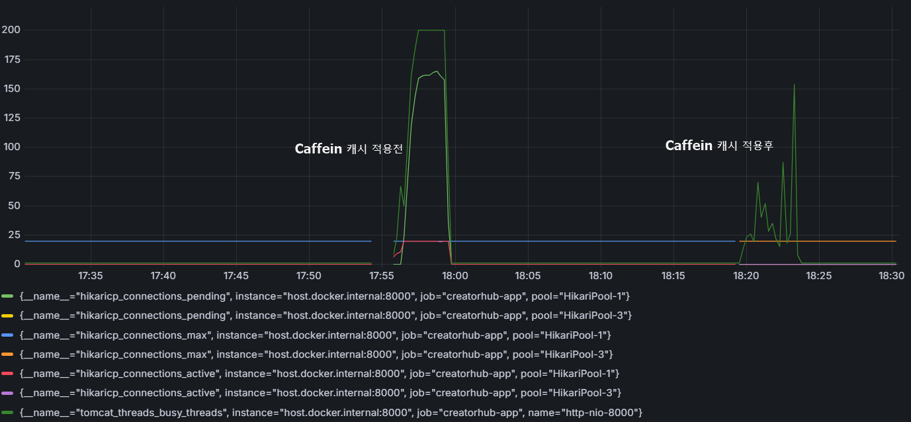

## 특정 회차 웹툰 읽기
#### **웹툰은 회차 보기가 가장 중요하므로 P95 Response Time을 300ms 이하로 목표**

### 요약
대용량 데이터(작품 7,000 / 에피소드 518k) 환경에서 웹툰 회차 조회 API 성능 개선을 진행하여 아래와 같이 개선함
- Throughput: 151.98 req/s → 2,748.5 req/s (약 18배 증가)
- P95 Latency: 1.97s → 131.98ms (약 93% 감소)

---

### Load Test Environment
- Tool: k6
- Scenario: ramping-vus
- Duration: 약 4분
- Server: Spring Boot (Docker)
- Database: MySQL 8
- Dataset
    - Creations: 7,000건
    - Episodes: 518,146건

### 부하 테스트 Scenario 상세
| Stage | Duration | VUs | Description |
|---|---|---|---|
| Warm-up | 30s | 0 → 50 | 서버 워밍업 |
| Ramp-up | 1m | 50 → 200 | 부하 증가 |
| Peak Load | 2m | 200 → 300 | 최대 부하 유지 |
| Ramp-down | 30s | 300 → 0 | 부하 감소 |

---

### 초기 성능 테스트 결과(Before Optimization)

| Metric | Result           |
|---|------------------|
| Total Requests | 36,498           |
| Throughput | **151.98 req/s** |
| Error Rate | **0.00%**        |
| Avg Response Time | 1.17 s           |
| P90 Response Time | 1.88 s           |
| P95 Response Time | 1.97 s           |
| P99 Response Time | 2.08 s           |
| Max Response Time | 3.35 s           |

```
    error_rate
    ✓ 'rate<0.01' rate=0.00%

    http_req_duration
    ✗ 'p(95)<500' p(95)=1.97s
    ✗ 'p(99)<1000' p(99)=2.08s
    
    ... 
    
    HTTP
    http_req_duration..............: avg=1.17s min=13.35ms med=1.26s max=3.35s p(90)=1.88s p(95)=1.97s
      { expected_response:true }...: avg=1.17s min=13.35ms med=1.26s max=3.35s p(90)=1.88s p(95)=1.97s
    http_req_failed................: 0.00%  0 out of 36498
    http_reqs......................: 36498  151.980571/s
    
    ...
```


----

### 첫번째 개선(1st Optimization)

####  1. 비동기 처리
- **Before:** incrementViewCount + updateTotalViewCount 2개의 UPDATE가 응답 경로에 동기 실행 → 300VU가 같은 행에 UPDATE 락 경쟁 → 대기 시간 누적(직렬화)
    ```
  episodeRepository.incrementViewCount(episodeId); // Episode 조회수 업데이트
  creationRepository.updateTotalViewCount(creationId); // Creation 조회수 통합 업데이트
    ```
- **After:** 조회수 증가 로직을 @Async 기반 비동기 처리로 전환하여 API 응답 경로에서 DB UPDATE 작업을 분리
- 응답속도와 관계없으므로 별도의 스레드풀에서 실행하도록 처리
   ```
   viewCountService.incrementAsync(episodeId, creationId);
   ```
   ```
    @Async("viewCountExecutor")
    @Transactional(propagation = Propagation.REQUIRES_NEW)
    public void incrementAsync(Long episodeId, Long creationId) {
        episodeRepository.incrementViewCount(episodeId);
        creationRepository.incrementTotalViewCount(creationId);
    }
  ```

#### 2. SUM 집계 → 단순 증가로 교체
- **Before:** 매 요청마다 SUM(e.viewCount) 서브쿼리 전체 집계 실행
    ```sql
    UPDATE Creation SET totalViewCount = (SELECT COALESCE(SUM(e.viewCount), 0) FROM Episode e ...)
    ```
- **After:** 단순 +1 증가로 변경
   ```sql
   UPDATE Creation SET totalViewCount = COALESCE(totalViewCount, 0) + 1
   ```

#### 3. 커넥션 풀 고갈 현상 발생
- **Before:** @EnableAsync가 없어서 @Async가 무시됨 → incrementAsync()가 동기 실행 → REQUIRES_NEW가 커넥션을 2개 요구 (readOnly 트랜잭션 커넥션 + REQUIRES_NEW 신규 커넥션) → 10개 pool이 5VU
  만에 고갈

    ```
    HikariPool-1 - Connection is not available, request timed out after 30009ms
    (total=10, active=10, idle=0, waiting=2)
    ```
- **After:** 
  - AsyncConfig.java에서 @EnableAsync 활성화
  - viewCountExecutor 빈 정의: 최대 5 스레드, 큐 10,000개(요청 급증시 최대 5개까지만 실행. 나머지는 큐에 잠시 대기)
      - 스레드 5개 = 최대 5개 커넥션만 점유(읽기 커넥션 여유분 확보)
    ```
    @EnableAsync
    public class AsyncConfig {
      @Bean(name = "viewCountExecutor")
        public Executor viewCountExecutor() {
           ThreadPoolTaskExecutor executor = new ThreadPoolTaskExecutor();
           executor.setCorePoolSize(2);
           executor.setMaxPoolSize(5);
           executor.setQueueCapacity(10000);
           ...
           // 큐가 꽉 찼을 때 작업을 버리지 않고 HTTP 요청 스레드(request thread)가 직접 실행
           executor.setRejectedExecutionHandler(new ThreadPoolExecutor.CallerRunsPolicy());
           ...      
      }
    }
    ```

  - application-local.yml
    - maximum-pool-size: 20 → 읽기(15개) + 비동기 쓰기(5개) 동시 처리 가능
    ```
    datasource:
      hikari:
       maximum-pool-size: 20
       minimum-idle: 5
       connection-timeout: 3000
     ```

  - @Transctional(readOnly = true) 제거
    - request 스레드(readOnly 트랜잭션으로 커넥션 A 보유)
      → CallerRunsPolicy 발동
      → REQUIRES_NEW 실행
      → 커넥션 B 추가 요청
      → 풀 고갈
    - @Transctional(readOnly = true) 제거를 통해 SELECT 시 잠깐 커넥션 사용 후 반납
    ```
    @Transactional(readOnly = true)
      public EpisodeDetailResponse getEpisodeDetail(Long creationId, Long episodeId) 
      { 
        ... 
      }
    ```

### 첫번째 개선 후
- Throughput(TPS)는 151.98 req/s → 195.2 req/s
- P95 Response Time은 1.97s → 1.9 s
- 수치상 거의 개선되지 않음

| Metric | Result          |
|---|-----------------|
| Total Requests | 46,640          |
| Throughput | **195.2 req/s** |
| Error Rate | **0.00%**       |
| Avg Response Time | 913.68 ms       |
| P90 Response Time | 1.82 s          |
| P95 Response Time | 1.9 s           |
| P99 Response Time | 1.99 s          |
| Max Response Time | 3.07 s          |

```
    error_rate
    ✓ 'rate<0.01' rate=0.00%

    http_req_duration
    ✗ 'p(95)<500' p(95)=1.9s
    ✗ 'p(99)<1000' p(99)=1.99s
    
    ...

    HTTP
    http_req_duration..............: avg=913.68ms min=309.84µs med=985.45ms max=3.07s p(90)=1.82s p(95)=1.9s
      { expected_response:true }...: avg=913.68ms min=309.84µs med=985.45ms max=3.07s p(90)=1.82s p(95)=1.9s
    http_req_failed................: 0.00%  0 out of 46640
    http_reqs......................: 46640  195.200892/s
    
    ...
```

---

### 두번째 개선(2nd Optimization)
- **Before:**
  - 비동기 처리를 했음에도 계속해서 커넥션 풀 고갈 현상이 발생하며, 단순 회차 조회만 하는 경우 p(95)=201.78ms 정도의 응답속도가 나옴
  - 가장 요청이 몰릴때 `SHOW ENGINE INNODB STATUS;` 쿼리문을 통해 InnoDB 내부 상태 확인 
  - 아래와 같이 동시 UPDATE LOCK 경쟁 발생
    ```sql
    update episode e1_0 
    set view_count=(coalesce(e1_0.view_count,0)+1) 
    where e1_0.id=7792 
    and (e1_0.deleted_at IS NULL) 
    ```

    ```
    LOCK WAIT ... lock_mode X locks rec but not gap waiting
    ```
- **After:**
  - 조회수는 느슨한 일관성이므로 이를 해결하기 위해 조회수 증가를 Redis에 먼저 누적하고, 10초 주기 배치 작업으로 DB에 반영하는 구조로 변경
    - 요청마다 UPDATE episode + UPDATE creation 요청마다 Redis INCR 
    ```
    public void increment(Long episodeId, Long creationId) {
        redisTemplate.opsForValue().increment(EPISODE_KEY_PREFIX  + episodeId);
        redisTemplate.opsForValue().increment(CREATION_KEY_PREFIX + creationId);
    }
    ```
    - 10초마다 쌓인 조회수(delta 값)를 DB에 한 번에 UPDATE
    ```
    @Scheduled(fixedDelay = 10_000)
    @Transactional
    public void flush() {
        flushPattern(EPISODE_KEY_PREFIX,
                episodeRepository::incrementViewCountBy);
        flushPattern(CREATION_KEY_PREFIX,
                creationRepository::incrementTotalViewCountBy);
    }
    ```
    
### 두번째 개선 후
| Metric | Result        |
|---|---------------|
| Total Requests | 341,144       |
| Throughput | 1,265.7 req/s |
| Error Rate | 0.01%         |
| Avg Response Time | 122.14 ms     |
| P90 Response Time | 217.4 ms     |
| P95 Response Time | 282ms ms     |
| P99 Response Time | 369.49ms     |
| Max Response Time | 924.68ms      |

```
    error_rate
    ✓ 'rate<0.01' rate=0.01%

    http_req_duration
    ✓ 'p(95)<500' p(95)=282ms
    ✓ 'p(99)<1000' p(99)=369.49ms

    ...

    HTTP
    http_req_duration..............: avg=122.14ms min=0s     med=130.91ms max=924.68ms p(90)=217.4ms p(95)=282ms   
      { expected_response:true }...: avg=122.15ms min=5.15ms med=130.96ms max=924.68ms p(90)=217.4ms p(95)=282.01ms
    http_req_failed................: 0.01%  51 out of 341144
    http_reqs......................: 341144 1265.786807/s
    ...
```


---

### 세번째 개선(3rd Optimization)


- **Before:**
  - 에피소드 상세 조회 API에 동일하거나 반복적인 조회 요청이 많이 발생했지만, 매 요청마다 DB에서 상세 데이터를 다시 조회
  - HikariCP 커넥션 풀(20개)에 대한 경쟁이 심해졌고, 동시 사용자 300 VU 환경에서 커넥션 대기 시간과 응답 지연이 누적

- **After:** 
  - Caffeine 인메모리 캐시 적용을 통해 캐시 hit 시 에피소드 상세 조회를 DB 대신 JVM 메모리에서 처리하여, 반복 조회 구간의 DB 접근 횟수와 커넥션 경쟁을 줄임
  - 테스트 중 캐시 스탬피드 현상이 발생해 `sync = true` 적용
    - k6로 부하 테스트 시 VU 50개가 동시에 같은 에피소드 첫 요청을 보내면 Caffeine 캐시가 모두 miss 처리되면서 50개 요청이 전부 DB를 동시에 때림

```
@EnableCaching
public class CacheConfig {

    @Bean
    public CacheManager cacheManager() {
        CaffeineCacheManager manager = new CaffeineCacheManager("episodeDetail");
        manager.setCaffeine(Caffeine.newBuilder()
                .maximumSize(2000) // 캐시에 저장가능 한 최대 엔트리 갯수
                .expireAfterWrite(5, TimeUnit.MINUTES)); // TTL: 5분
        return manager;
    }
}
```
```
@Cacheable(
     value = "episodeDetail",
     key = "#creationId + ':' + #episodeId",
     sync = true
)
public EpisodeDetailResponse getEpisodeDetail(Long creationId, Long episodeId) { 
    ... 
}
```

### 세번째 개선 후


| Metric | Result            |
|---|-------------------|
| Total Requests | 691,812           |
| Throughput | **2,748.5 req/s** |
| Error Rate | **0.02%**         |
| Avg Response Time | 54.13 ms          |
| P90 Response Time | 110.76ms          |
| P95 Response Time | 131.98ms          |
| P99 Response Time | 183.07ms          |
| Max Response Time | 461.72ms          |
```
    error_rate
    ✓ 'rate<0.01' rate=0.02%

    http_req_duration
    ✓ 'p(95)<500' p(95)=131.98ms
    ✓ 'p(99)<1000' p(99)=183.07ms

    ...
    
    HTTP
    http_req_duration..............: avg=54.13ms min=0s    med=45.02ms max=461.72ms p(90)=110.76ms p(95)=131.98ms
      { expected_response:true }...: avg=54.14ms min=1.1ms med=45.04ms max=461.72ms p(90)=110.77ms p(95)=131.98ms
    http_req_failed................: 0.02%  146 out of 691812
    http_reqs......................: 691812 2748.505308/s
    ...
```
---

### 기타
- 차후 첫번째 개선에서 적용한 비동기를 제거하니 아래와 같은 미약한 수치 변화를 보임
- Throughput(TPS)는 2748.50 req/s → 2338.35 req/s
- P95 Response Time은 131.98ms → 123.07ms
- 결론적으로 전체 구조 복잡도만 증가하고 성능개선에 비동기는 유의미하지 않다고 판단해 제거

---

### 부하 테스트 수치 변화

| Metric            | Before       | 1st Optimization | 2nd Optimization | 3rd Optimization  |
| ----------------- | ------------ | ---------------- | ---------------- | ----------------- |
| Total Requests    | 36,498       | 46,640           | 341,144          | **691,812**       |
| Throughput        | 151.98 req/s | 195.2 req/s      | 1,265.7 req/s    | **2,748.5 req/s** |
| Error Rate        | 0.00%        | 0.00%            | 0.01%            | **0.02%**         |
| Avg Response Time | 1.17 s       | 913.68 ms        | 122.14 ms        | **54.13 ms**      |
| P90 Response Time | 1.88 s       | 1.82 s           | 217.4 ms         | **110.76 ms**     |
| P95 Response Time | 1.97 s       | 1.9 s            | 282 ms           | **131.98 ms**     |
| P99 Response Time | 2.08 s       | 1.99 s           | 369.49 ms        | **183.07 ms**     |
| Max Response Time | 3.35 s       | 3.07 s           | 924.68 ms        | **461.72 ms**     |
